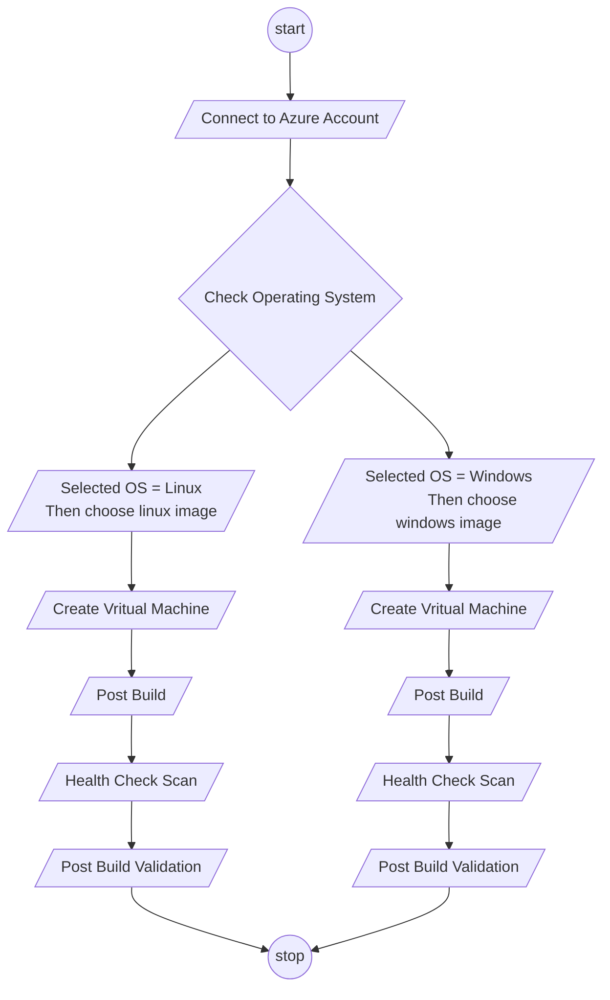

# Azure Resource Provision
| Project | Environment | Pipeline Name | Author |
| :----: | :----: | :----: | :----:|
| Automation | DEV/TEST/PROD | Azure Virtual Machine Deployment |  **Anand Babu P**<br>Senior Technical Leader \| [anbu143dude@gmail.com](mailto:anbu143dude@gmail.com)|

<!-- TABLE OF CONTENTS -->
### <ins>Table of Content<ins>
<details>
    <summary>Contents:</summary>
    <ol>
        <li><a href="#azure-virtual-machine-base-deployment">Azure Virtual Machine Base Deployment</a></li>
            <ul>
                <li><a href="#pre-requisites">Pre-requisites</a></li> 
                    <ul>
                        <li><a href="#assumptions">Assumptions</a></li>      
                    </ul>
                <li><a href="#synopsis">Synopsis</a></li>
                <li><a href="#input-parameters">Input Parameters</a></li>
            </ul>
        <li><a href="#azure-virtual-machine-deployment">Azure Virtual Machine Deployment</a></li>
            <ul>
                <li><a href="#pre-requisites">Pre-requisites</a></li> 
                    <ul>
                        <li><a href="#assumptions">Assumptions</a></li>      
                    </ul>
                <li><a href="#synopsis">Synopsis</a></li>
                <li><a href="#input-parameters">Input Parameters</a></li>
                <li><a href="#architecture-overview">Architecture Overview</a></li>
                <li><a href="#flow-chart">Flow Chart</a></li>
                <li><a href="#reference">Reference</a></li>
            </ul>
    </ol>
</details

<!-- VIRTUAL MACHINE Base DEPLOYMENT -->
## Azure Virtual Machine Base Deployment

<!-- PRE-REQUISITES -->
### Pre-requisites:
- Azure Storage Account and file share to be created to store the post build logs, health check scan report and script.
- Azure DevOps should have sufficient privilage to sync with GitHub and exectue the pipeline tasks.
- Key Vault to store all credentials as secrets.
- Log Analytics Workspace to link with Automation Account, this will capture all the jobs and used install update management agent in vm for patch update.

<!-- ASSUMPTIONS -->
#### Assumptions:
- All the inpurt parameters will be provided by engineer at the time of triggering pipeline.

---
<!-- SYNOPSIS -->
### Synopsis:
- This is the process of deploying resources required for automating Azure VM provisioning Windows / Linux Operating system.
- This process perform create resources required base deployment
- This process will be triggered by engineer from azure devops portal.
- The pipeline executes the pipeline tasks in sequance.
- All credentials are stored in keyvault.

---
<!-- INPUT PARAMETERS -->
### Input Parameters:
| Name | Type | Description | Required |
| :---- | :---- | :---- | :---- |
| subcription | *`string`* | Provide *subscription* id | Yes |
| environment | *`string`* | Provide *environment* | Yes |

```yaml
parameters:
  - name: subscription
    displayName: 'Subscription'
    type: string
  - name: environment
    displayName: 'Environment'
    type: string
```

<!-- VIRTUAL MACHINE DEPLOYMENT -->
## Azure Virtual Machine Deployment

<!-- PRE-REQUISITES -->
### Pre-requisites:
- Azure Storage Account and file share to be created to store the post build logs, health check scan report and script.
- Azure DevOps should have sufficient privilage to sync with GitHub and exectue the pipeline tasks.
- Key Vault to store all credentials as secrets.
- Log Analytics Workspace to link with Automation Account, this will capture all the jobs and used install update management agent in vm for patch update.

<!-- ASSUMPTIONS -->
#### Assumptions:
- One Azure VM can be request for build in service catalog.
- While triggering the pipeline manually from the DevOps portal engineer will provide input paratemrs.

---
<!-- SYNOPSIS -->
### Synopsis:
- This is the process of Azure VM provisioning Windows / Linux Operating system.
- This process perform build, post build, health check scan and post build validation in the Azure VM.
- End user / Engineer will submit service request with all thre required specifications
- Once the reqeuest is approved SNOW catalog will trigger the Azure pipeline automatically.
- The pipeline executes the pipeline tasks in sequance.
- Logic App perform ticket creation/Updation/Closure.
- Engineer to update the raw github url with token in keyvault.
- All credentials are stored in keyvault.

---
<!-- INPUT PARAMETERS -->
### Input Parameters:
| Name | Type | Description | Required |
| :---- | :---- | :---- | :---- |
| subcription | *`string`* | Provide *subscription* id | Yes |
| resource_group | *`string`* | Provide *resource group* name | Yes |
| region | *`string`* | Provide *region* | Yes |
| environment | *`string`* | Provide *environment* | Yes |
| vm_name | *`string`* | Provide *virtual machine* name | Yes |
| vm_size | *`string`* | Provide *virtual machine* size | Yes |
| image | *`string`* | Provide *virtual machine* image | Yes |
| availability_zone | *`string`* | Provide *avilability zone* | Yes |
| virtual_network | *`string`* | Provide *virtual network* name | Yes |
| subnet | *`string`* | Provide *subnet* name | Yes |
| backup_required | *`string`* | Choose *backup policy* option Yes/No  | Yes |
| time_zone | *`string`* | Provide *time zone* name | Yes |
| admin_sudo_access_1 | *`string`* | Provide *security group/username* to grant administrator access | Yes |
| admin_sudo_access_2 | *`string`* | Provide *security group/username* to grant administrator access | Yes |
| admin_sudo_access_3 | *`string`* | Provide *security group/username* to grant administrator access | Yes |
| data_disk | *`string`* | Provide *datadisk* name, size, and sku | Yes |
| accelerated_networking | *`string`* | Provide *time zone* name | Yes |
| tasknumber | *`string`* | Provide *tasknumber* from SNOW | Yes |
| sysid | *`string`* | Provide *system id* from SNOW | Yes |

```yaml
parameters:
  - name: subscription
    displayName: 'Subscription'
    type: string
  - name: resource_group
    displayName: 'Resource Group Name'
    type: string
  - name: region
    displayName: 'Region'
    type: string
  - name: environment
    displayName: 'Environment'
    type: string
  - name: vm_name
    displayName: 'Virtual Machine Name'
    type: string
  - name: vm_size
    displayName: 'Size/SKU'
    type: string
  - name: image
    displayName: 'OS Image Name'
    type: string
  - name: availability_zone
    displayName: 'Availability Zone'
    type: string
  - name: virtual_network
    displayName: 'Virtual Network'
    type: string
  - name: subnet
    displayName: 'Subnet'
    type: string
  - name: backup_required
    displayName: 'Backup Required (Yes/No)'
    type: string
  - name: time_zone
    displayName: 'Time Zone'
    type: string
  - name: admin_sudo_access_1
    displayName: Administrator Access Username/Group 1
    type: string
  - name: admin_sudo_access_2
    displayName: Administrator Access Username/Group 2
    type: string
  - name: admin_sudo_access_3
    displayName: Administrator Access Username/Group 3
    type: string
  - name: data_disk
    displayName: 'Data Disk'
    type: string
  - name: accelerated_networking
    displayName: 'Accelerated Networking to enable (Yes/No)'
    type: string
  - name: tasknumber
    displayName: 'SNOW Task Number'
    type: string
  - name: sysid
    displayName: 'SNOW sys ID'
    type: string
```
---
<!-- ARCHITECTURE -->
### Architecture Overview:


---
<!-- FLOW CHART -->
### Flow Chart:
